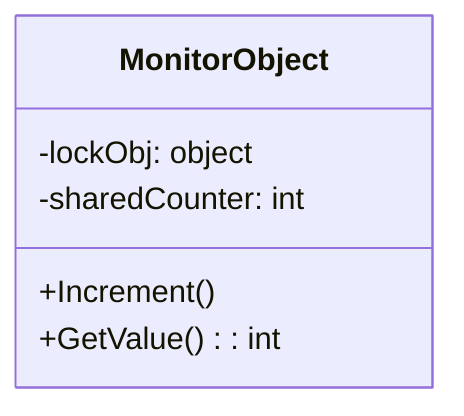
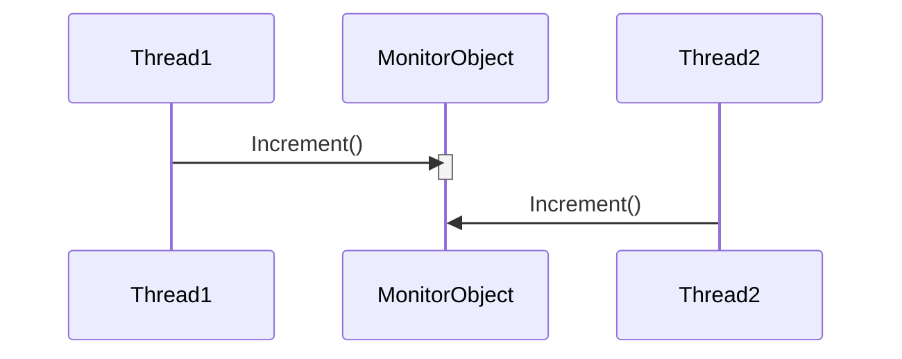

## 🔷 4. Monitor Object
**Тип:** Concurrency  
**Призначення:** Синхронізований доступ до спільного ресурсу в багатопотоковому середовищі.

### UML - класів

```mermaid
classDiagram
    class MonitorObject {
        -lockObj: object
        -sharedCounter: int
        +Increment()
        +GetValue(): int
    }
```

### UML - послідовності

```mermaid
sequenceDiagram
    participant Thread1
    participant MonitorObject
    participant Thread2
    Thread1->>MonitorObject: Increment()
    activate MonitorObject
    deactivate MonitorObject
    Thread2->>MonitorObject: Increment()
```
